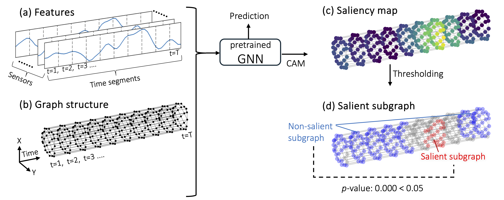

<div align="center">
    <h1 align="center"> Statistical Test for Saliency Maps of Graph Neural Networks via Selective Inference
    </h1>

Shuichi Nishino, Tomohiro Shiraishi, Teruyuki Katsuoka, Ichiro Takeuchi


<a href="https://www.arxiv.org/abs/2505.16893">
</a>

</div>




## Installation & Requirements
This package has the following dependencies:
- Python (version 3.10 or higher, we use 3.10.17)
- sicore 2.2.0 or later
- torch 2.1.0 or later
- onnx 1.16.1 or later
- onnxoptimizer 0.3.13 or later
- tqdm
- pandas

Install the dependencies using pip:
```
pip install sicore==2.2.0 torch==2.1.0 onnx==1.16.1 onnxoptimizer==0.3.13 tqdm pandas
```

## Reproducibility
Since we have already got the results in advance, you can reproduce the figures by running following code. The results will be saved in "/figures" folder.

```
sh plot.sh
```

To reproduce the results, please conduct the following procedures after installation step. 
The results will be saved in "./results" folder as pickle file.

For reproducing the Figures 3 (Type I error rate and Power).
```
sh exp_synth.sh
```

For reproducing the Figures 6 (robustness to non-Gaussian noise).
```
sh exp_nongauss.sh
```

For reproducing the Figures 7 (Robustness to Estimated Variance).
```
sh exp_covest.sh
```

## Citation
```bibtex
@article{nishino2025gnn,
title={Statistical Test for Saliency Maps of Graph Neural Networks via Selective Inference},
author={Nishino, Shuichi and Shiraishi, Tomohiro and Katsuoka, Teruyuki and Takeuchi, Ichiro},
journal={Transactions on Machine Learning Research},
year={2025},
url={https://openreview.net/forum?id=5NkXTCVa7F},
note={}
}
```